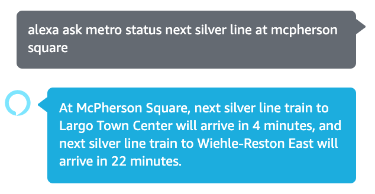
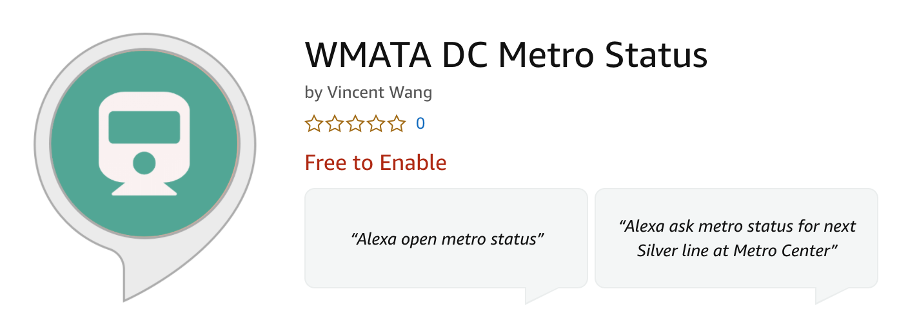
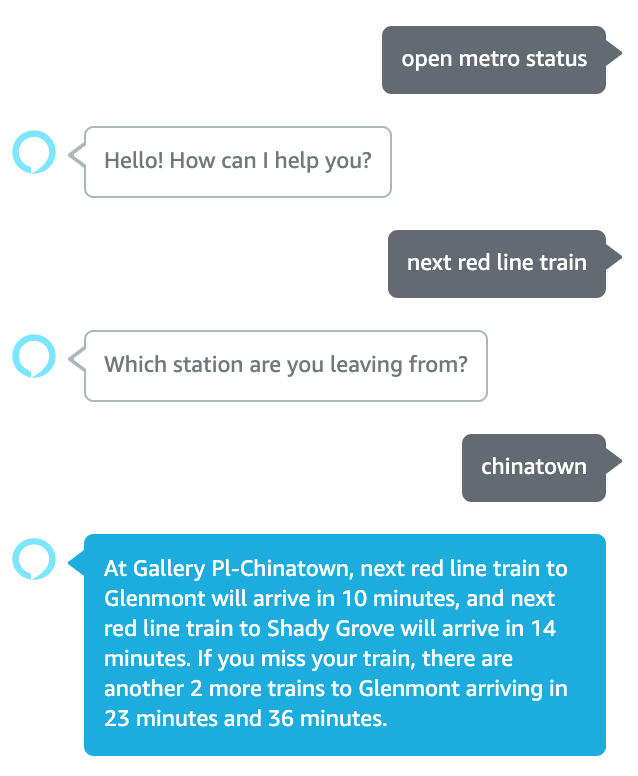
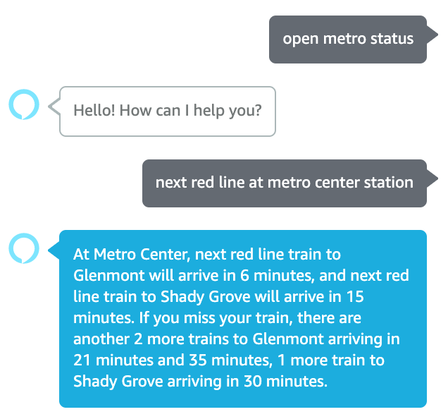
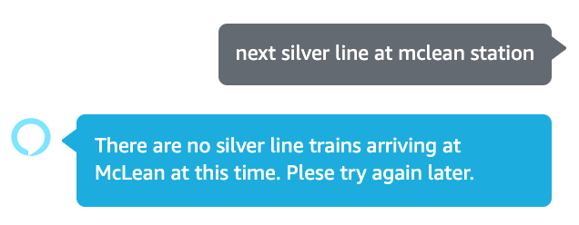

  <h1>WMATA DC Metro Status</h1>
  
 
    
  

You can ask Alexa what time your next train arrives at your station!

## How to download

 
    

You can search "WMATA DC Metro Status" on Alexa Skills Store on Amazon Alexa app or enable it directly on [amazon.com](https://www.amazon.com/dp/B087RP35L2/ref=sr_1_1?dchild=1&keywords=wmata+dc+metro&qid=1588135285&s=digital-skills&sr=1-1). 

## Technologies
- **Node.js**: Backend to create the skills
- **AWS Lambda**: Backend to host the skills

## Data Provider
- **[WMATA](https://developer.wmata.com/)**: Washington Metropolitan Area Transit Authority API

## Key features
Note you don't have to say the same exact sentences. Alexa is smart enough to parse your sentence into commands that she understands with this skill and reply to you with information you ask. She will also ask to clarify if she needs more information such as the line color and the station name.

You can say "Alexa ask metro status for next silver line train at Metro Center station".

1. **Arrival times of the next trains to each destination**: Since a metro line is bi-directional and sometimes it stops at different destinations, Alexa will list out the trains to each destination for you.
2. **Subsequent arrival times after the next train**: In case you can not make it to the very next train, Alexa will list out the subsequent trains' arrival times as well.

## How to use the features
You can either invoke the skill about saying "open metro status" or just directly ask Alexa a question by saying things like "Alexa ask metro status for next silver line train at metro center?"

Tell Alexa to check directly|She will ask to clarify if you didn't provide a station or metro line
:-------------------------:|:-------------------------:
|

|She will also tell you the subsequent trains if you can't make it to next one|When there is no train avaliable
:-------------------------:|:-------------------------:
|
